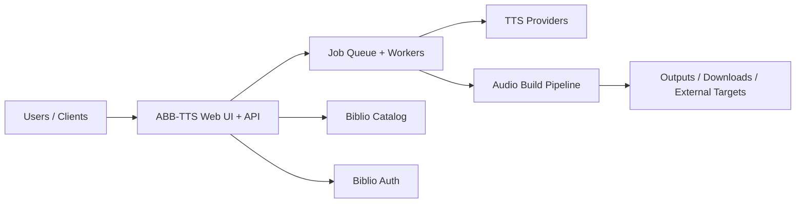

# Biblio Audiobook Builder TTS

> Part of the [BiblioHub](https://github.com/vpoluyaktov/biblio-hub) application suite

## Overview

**Biblio Audiobook Builder TTS** converts eBooks (EPUB/FB2 and related sources) into audiobooks using multiple TTS backends. It provides a web experience for job submission, monitoring, and result delivery.

Core purpose:

- Turn e-book content into audiobook artifacts suitable for playback and library ingestion
- Support multiple provider types (self-hosted and cloud) with configurable conversion behavior
- Enable asynchronous, multi-user conversion workflows with progress visibility
- Integrate with Biblio services (Catalog/Auth) and optional downstream destinations

## Architecture (High Level)



## Interfaces (Summary)

The service provides:

- Web and API workflows for creating and tracking audiobook jobs
- Provider and voice management surfaces
- Real-time progress updates for long-running conversions
- Integration points for catalog sourcing and authentication

Detailed endpoint contracts, configuration references, and operational commands are maintained in `README.md`.

## Project Structure (Key Parts)

```
biblio-audiobook-builder-tts/
├── Specification.md
├── README.md
├── internal/            # server, workers, storage, parser, tts, audio pipelines
├── tests/               # unit/integration coverage
└── output/              # generated artifacts (runtime)
```

## Development Status

**Service status: Operational**

- ✅ End-to-end audiobook generation pipeline is production-capable
- ✅ Multi-provider TTS orchestration and provider-level behavior controls are available
- ✅ Job lifecycle management and user-facing progress workflows are in place
- ✅ Integrated with BiblioHub routing and related platform services

## Development Priorities

1. Conversion reliability and throughput improvements for large workloads
2. UX improvements for provider testing, diagnostics, and operations
3. Security and authentication maturity across deployment modes
4. Continued quality improvements in text preprocessing and narration naturalness

---

## Key Implementation Notes

### Text Processing Pipeline

**Processing Order** (critical for correct results):
1. **Pronunciation Dictionary** (`internal/sanitize/data/*.csv`) - Applied first
   - User-defined regex patterns for word/phrase replacements
   - Supports both plain text and SSML replacements
   - Language-specific rules (en.csv, ru.csv)
   - Pattern order matters - place more specific patterns before general ones

2. **Latin-to-Russian Transliteration** (`internal/sanitize/latin_ru.go`) - Provider toggle
   - Uppercase-only words → letter-by-letter (FBI → эф би ай)
   - Lowercase/mixed-case → phonetic (Microsoft → микрософт)
   - Only applies in Russian text context (20%+ Cyrillic)

3. **Number Normalization** (`internal/normalize/`) - Provider toggle
   - Language-specific processors (russian.go, english.go)
   - Context-aware (dates, ordinals, gender agreement)
   - Noun database for grammatical forms (`data/en.csv`, `data/ru.csv`)

4. **Stress Marking** (`internal/stress/`) - Provider toggle
   - Russian homograph disambiguation
   - Sentence-by-sentence processing

### File Naming Conventions

**Chapter files**: 4-digit prefix format (`%04d`)
- Examples: `0001_Chapter1.txt`, `0001_Chapter1.wav`, `0001_Chapter1.ssml.txt`
- Supports up to 9,999 chapters with correct sorting

**Multi-part M4B files**: 3-digit suffix format (`%03d`)
- Example: `Book_Title, Part 001.m4b`
- Supports up to 999 parts with correct sorting

### Russian Grammar Rules

**Critical patterns to remember**:
- Dates with months → always genitive case (27 марта → двадцать седьмого марта)
- Years before "году" → prepositional case (В 1876 году → одна тысяча восемьсот семьдесят шестом году)
- Measurement units → plural genitive (100 м → 100 метров)
- Gender detection for numbers ending in 2 → check noun database first, then heuristics
- Time formats (HH:MM, HH.MM.SS) → remove punctuation before normalization

### Pronunciation Dictionary Patterns

**Pattern requirements**:
- Measurement units must include `(\d+)\s*` prefix and `[\s\.]` suffix
  - Correct: `(\d+)\s*м[\s\.],$1 метров`
  - Wrong: `\bм\b,метр` (matches words like "метр")
- Year of birth (г.р.) must come BEFORE weight units (г) in ru.csv
- Context-specific patterns prevent false matches

---

### Future Enhancements

- Deeper observability of conversion pipeline stages
- Expanded provider ecosystem and interoperability
- Better automated quality checks for generated audio
- Further improvements for multilingual normalization and narration quality

## Contribution Guidance

- Keep this document high-level (purpose, architecture, state, roadmap).
- Keep endpoint payloads, env matrices, implementation logs, and operational runbooks in `README.md` and dedicated docs.
- Update **Development Status** and **Development Priorities** when capabilities evolve.

---

*Last updated: 2026-02-18*
