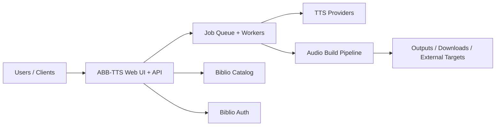

# Biblio Audiobook Builder TTS

> Part of the [BiblioHub](https://github.com/vpoluyaktov/biblio-hub) application suite

## Overview

**Biblio Audiobook Builder TTS** converts eBooks (EPUB/FB2 and related sources) into audiobooks using multiple TTS backends. It provides a web experience for job submission, monitoring, and result delivery.

Core purpose:

- Turn e-book content into audiobook artifacts suitable for playback and library ingestion
- Support multiple provider types (self-hosted and cloud) with configurable conversion behavior
- Enable asynchronous, multi-user conversion workflows with progress visibility
- Integrate with Biblio services (Catalog/Auth) and optional downstream destinations

## Architecture (High Level)



## Interfaces (Summary)

The service provides:

- Web and API workflows for creating and tracking audiobook jobs
- Provider and voice management surfaces
- Real-time progress updates for long-running conversions
- Integration points for catalog sourcing and authentication

Detailed endpoint contracts, configuration references, and operational commands are maintained in `README.md`.

## Project Structure (Key Parts)

```
biblio-audiobook-builder-tts/
├── Specification.md
├── README.md
├── internal/            # server, workers, storage, parser, tts, audio pipelines
├── tests/               # unit/integration coverage
└── output/              # generated artifacts (runtime)
```

## Development Status

**Service status: Operational**

- ✅ End-to-end audiobook generation pipeline is production-capable
- ✅ Multi-provider TTS orchestration and provider-level behavior controls are available
- ✅ Job lifecycle management and user-facing progress workflows are in place
- ✅ Integrated with BiblioHub routing and related platform services

## Development Priorities

1. Conversion reliability and throughput improvements for large workloads
2. UX improvements for provider testing, diagnostics, and operations
3. Security and authentication maturity across deployment modes
4. Continued quality improvements in text preprocessing and narration naturalness

---

## Recent Changes

### 2026-02-18: Cover Extraction via Unified Parser Library

**Cover extraction now handled by unified parser library:**
- All cover extraction uses `biblio-ebook-parser` library
- Cover images extracted through parser's `Metadata.CoverData` field
- Supports both EPUB and FB2 formats
- Fast extraction without parsing full book content

**Benefits:**
- Eliminates potential code duplication
- Automatic bug fixes when parser library is updated
- Consistent cover handling across all Biblio services
- Option to use `cover.GeneratePlaceholder()` for missing covers

**Implementation:**
- Parser adapter in `internal/parser/adapter.go` extracts cover from metadata
- Cover data stored in `Book.CoverImage` field
- Preview store serves covers via `/api/preview/{id}/cover` endpoint

### 2026-02-18: Fix TTS Crash on ASCII Special Characters

**Issue**: Silero TTS engine crashed with HTTP 400 error when encountering certain ASCII special characters in text (e.g., `$`, `%`, `#`, `^`, `*`, `@`, etc.). Error example:
```
TTS synthesis failed: '^'
```

**Root Cause**: The text sanitization in `internal/sanitize/text.go` handled Unicode special characters but did not remove problematic ASCII special characters that appear in:
- Censored/profanity text (e.g., `***`, `$#@!`)
- Broken formatting/encoding artifacts
- HTML/XML tags in improperly parsed content
- Programming symbols in non-technical text

**Solution**: Enhanced `TextForTTS()` function to remove ASCII special characters that cause TTS engines to fail:
- Removed: `$`, `%`, `#`, `^`, `*`, `@`, `~`, `|`, `\`, `/`, `<`, `>`, `{`, `}`, `[`, `]`
- Converted to space: `_` (underscore)
- Preserved: `!`, `&` (legitimate punctuation)

**Testing**: Added comprehensive test suite covering:
- Real-world bug case from error report
- Individual special character removal
- Multiple consecutive special characters
- Edge cases (only special chars, mixed with text)
- Preservation of legitimate punctuation

**Impact**: Prevents TTS conversion failures on books with special characters in dialogue, censored text, or formatting artifacts.

### 2026-02-18: OPDS Author and Series Search Support

**Extended OPDS catalog browser to support author and series search:**
- Added `SeriesSearchURL` field to `SearchInfo` struct in OPDS client
- Updated `GetSearchTemplateByType()` to handle "series" search type
- Extended OPDS feed parsing to extract series search URLs from catalog links
- Added series search option to UI dropdown (By Title / By Author / By Series)
- Updated JavaScript to dynamically show available search types based on catalog capabilities

**Benefits:**
- Users can now search for books by author name or series name in OPDS catalogs
- Seamless integration with biblio-ebooks-catalog's new search endpoints
- UI automatically adapts to show only search types supported by each catalog
- Consistent search experience across all OPDS catalog sources

**Implementation:**
- OPDS client: `internal/opds/client.go` - `SearchInfo` struct and `GetSearchTemplateByType()`
- UI template: `internal/server/templates/index.html` - added series option to dropdown
- JavaScript: `internal/server/assets/app.js` - `updateSearchTypeOptions()` and `updateSearchPlaceholder()`
- Backend handler: `internal/server/opds_handlers.go` - already supports type parameter

---

### Future Enhancements

- Deeper observability of conversion pipeline stages
- Expanded provider ecosystem and interoperability
- Better automated quality checks for generated audio
- Further improvements for multilingual normalization and narration quality

## Contribution Guidance

- Keep this document high-level (purpose, architecture, state, roadmap).
- Keep endpoint payloads, env matrices, implementation logs, and operational runbooks in `README.md` and dedicated docs.
- Update **Development Status** and **Development Priorities** when capabilities evolve.

---

*Last updated: 2026-02-18*
