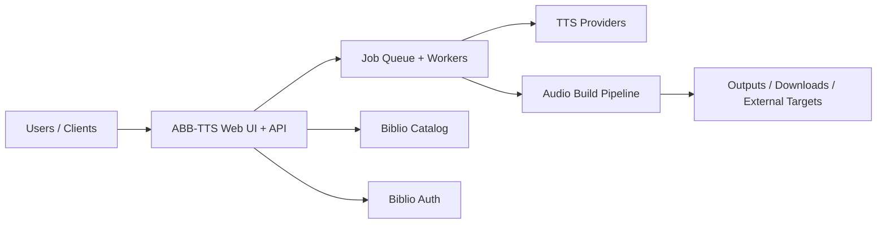

# Biblio Audiobook Builder TTS

> Part of the [BiblioHub](https://github.com/vpoluyaktov/biblio-hub) application suite

## Overview

**Biblio Audiobook Builder TTS** converts eBooks (EPUB/FB2 and related sources) into audiobooks using multiple TTS backends. It provides a web experience for job submission, monitoring, and result delivery.

Core purpose:

- Turn e-book content into audiobook artifacts suitable for playback and library ingestion
- Support multiple provider types (self-hosted and cloud) with configurable conversion behavior
- Enable asynchronous, multi-user conversion workflows with progress visibility
- Integrate with Biblio services (Catalog/Auth) and optional downstream destinations

## Architecture (High Level)



## Interfaces (Summary)

The service provides:

- Web and API workflows for creating and tracking audiobook jobs
- Provider and voice management surfaces
- Real-time progress updates for long-running conversions
- Integration points for catalog sourcing and authentication

Detailed endpoint contracts, configuration references, and operational commands are maintained in `README.md`.

## Project Structure (Key Parts)

```
biblio-audiobook-builder-tts/
├── Specification.md
├── README.md
├── internal/            # server, workers, storage, parser, tts, audio pipelines
├── tests/               # unit/integration coverage
└── output/              # generated artifacts (runtime)
```

## Development Status

**Service status: Operational**

- ✅ End-to-end audiobook generation pipeline is production-capable
- ✅ Multi-provider TTS orchestration and provider-level behavior controls are available
- ✅ Job lifecycle management and user-facing progress workflows are in place
- ✅ Integrated with BiblioHub routing and related platform services

## Development Priorities

1. Conversion reliability and throughput improvements for large workloads
2. UX improvements for provider testing, diagnostics, and operations
3. Security and authentication maturity across deployment modes
4. Continued quality improvements in text preprocessing and narration naturalness

---

## Recent Changes

### 2026-02-20: Latin Letter Pronunciation in Russian Text

**Feature**: Automatic conversion of Latin letters and abbreviations to Russian pronunciation when they appear in Russian text.

**Motivation**: Russian TTS engines struggle with Latin letters and abbreviations (like "FBI", "USB", "DC-19") embedded in Russian text. These need to be converted to their Russian phonetic equivalents for proper narration.

**Implementation**:
- **Core Module**: New `internal/sanitize/latin_ru.go` with `LatinToRussianConverter`
- **Context Detection**: Intelligent detection of Russian vs English text context using Cyrillic character ratio analysis
- **Pattern Matching**: Regex-based detection of Latin abbreviations, including:
  - Simple abbreviations: `FBI` → `эф би ай`
  - Hyphenated models: `DC-19` → `ди си 19`, `L-3` → `эл 3`
  - Complex patterns: `DC-19-A` → `ди си 19-эй`
  - Number+letter: `5G` → `5 джи`, `4G` → `4 джи`
  - Mixed case: `WiFi` → `дабл ю ай эф ай`, `GHz` → `джи эйч зет`

**CSV Data**: 
- Created `internal/sanitize/data/latin_ru.csv` with comprehensive Latin letter pronunciations
- Includes common technology abbreviations (USB, HDMI, CPU, GPU, etc.)
- Includes organizations (NASA, FBI, CIA, NATO, etc.)
- Includes business/medical/scientific terms (CEO, PhD, DNA, RNA, etc.)

**Context Detection Logic**:
- Analyzes 50-character window around each abbreviation
- Converts if Cyrillic characters present and either:
  - More Cyrillic than Latin characters, OR
  - Cyrillic represents at least 20% of total letters
- Prevents false conversions in English text with occasional Russian words

**Examples**:
```
Input:  "Агентство FBI использует технологию AI"
Output: "Агентство эф би ай использует технологию эй ай"

Input:  "Самолет DC-10 совершил посадку"
Output: "Самолет ди си 10 совершил посадку"

Input:  "Подключите USB устройство"
Output: "Подключите ю эс би устройство"

Input:  "Процессор CPU работает на частоте 3 GHz"
Output: "Процессор си пи ю работает на частоте 3 джи эйч зет"
```

**Testing**: Comprehensive test suite with 50+ test cases covering:
- Simple abbreviations (2-3 letters)
- Single letters (A, B, C)
- Hyphenated patterns (DC-19, L-3, DC-19-A)
- Number+letter patterns (5G, 4G)
- Mixed case (WiFi, PhD, HTML, CSS)
- Context detection (Russian vs English text)
- Edge cases (punctuation, newlines, special characters)
- Real-world examples (technical docs, news articles, aviation, medical, IT)

**Benefits**:
- Proper Russian narration of technical terms and abbreviations
- Automatic handling without manual text preprocessing
- Context-aware to avoid false conversions in English text
- Extensible via CSV data files for new abbreviations

---

### 2026-02-19: Fix Russian Date Normalization to Use Genitive Case

**Issue**: Russian dates with month names were incorrectly using nominative case instead of genitive case:
- Input: `27 марта 1977 года`
- Incorrect output: `двадцать седьмое марта одна тысяча девятьсот семьдесят седьмого года`
- Correct output: `двадцать седьмого марта одна тысяча девятьсот семьдесят седьмого года`

- Input: `21 декабря 1988 года`
- Incorrect output: `двадцать первое декабря одна тысяча девятьсот восемьдесят восьмого года`
- Correct output: `двадцать первого декабря одна тысяча девятьсот восемьдесят восьмого года`

**Root Cause**: The `DetectContext` function in `internal/normalize/russian.go` was only applying genitive case to dates when preceded by specific trigger words (like "произошла", "случилось"). However, in Russian grammar, dates with month names are **always** in genitive case, regardless of context.

**Solution**: 
- Modified `DetectContext()` to always set genitive case when a number appears before a Russian month name
- Updated `processDateRanges()` to apply genitive case transformation for date ranges (e.g., "6-16 августа")
- Removed conditional genitive case logic that depended on trigger words for dates with months

**Behavior**:
- Simple dates: `27 марта` → `двадцать седьмого марта` (genitive)
- Full dates: `21 декабря 1988 года` → `двадцать первого декабря одна тысяча девятьсот восемьдесят восьмого года`
- Date ranges: `6-16 августа` → `шестого, тире, шестнадцатого августа`
- Dates with trigger words still work: `произошла 27 марта` → `произошла двадцать седьмого марта`

**Testing**: Added comprehensive test cases for both reported bug examples and updated all existing date tests to expect genitive case. All Russian normalization tests pass.

**Impact**: Fixes grammatically incorrect Russian date narration throughout all audiobook conversions.

### 2026-02-19: Fix Hyphen Normalization in Model Names

**Issue**: Hyphens in model names (like DC-7, Ту-154, Боинг-747) were being treated as minus signs, resulting in incorrect normalization:
- Input: `DC-7`
- Incorrect output: `DC minus seven`
- Correct output: `DC seven`

- Input: `Ту-154`
- Incorrect output: `Ту минус сто пятьдесят четыре`
- Correct output: `Ту сто пятьдесят четыре`

- Input: `Боинг-747`
- Incorrect output: `Боинг минус семьсот сорок семь`
- Correct output: `Боинг семьсот сорок семь`

**Root Cause**: The number pattern regex (`-?\d+`) matches numbers with optional leading hyphens, treating them as minus signs. When a hyphen appears after a letter (as in model names), it should be treated as a separator, not a minus sign.

**Solution**: 
- Enhanced hyphen detection logic in `internal/normalize/processor.go` to distinguish between:
  - Actual minus signs (preceded by whitespace or at text start)
  - Hyphens as separators in model names (preceded by letters)
- Fixed UTF-8 character handling to properly detect Cyrillic and other multi-byte characters before hyphens
- When a hyphen follows a letter, the hyphen is replaced with a space and only the number is normalized

**Behavior**:
- Model names: `DC-7` → `DC seven`, `Ту-154` → `Ту сто пятьдесят четыре`
- Negative numbers: `-5 degrees` → `minus five degrees` (unchanged)
- Ordinal suffixes: `1996-го` → `одна тысяча девятьсот девяносто шестого` (unchanged)

**Testing**: Added comprehensive test cases for both English and Russian hyphenated model names. All existing tests continue to pass.

**Impact**: Fixes incorrect narration of aircraft models, vehicle designations, and other hyphenated alphanumeric identifiers in both English and Russian text.

### 2026-02-18: Fix English Ordinal Triggers for Arabic Numbers

**Issue**: English tests were failing because "chapter" and "page" were not triggering ordinal numbers for Arabic numerals. Examples:
- Input: `Chapter 5`
- Incorrect output: `Chapter five` (cardinal)
- Correct output: `Chapter fifth` (ordinal)

**Root Cause**: The English noun database had "chapter" and "page" marked as cardinal triggers (`c`) instead of ordinal triggers (`o`). This was intentional for Roman numerals ("Chapter VII" → "Chapter seven"), but Arabic numbers should use ordinal form.

**Solution**: 
- Changed "chapter" and "page" to ordinal triggers (`o`) in English noun database (`internal/normalize/data/en.csv`)
- Updated Roman numeral processing in `internal/normalize/roman.go` to always use cardinal form for English Roman numerals after nouns, regardless of the noun's trigger form
- This allows different behavior for Roman vs Arabic numbers with the same noun

**Behavior**:
- Roman numerals: `Chapter VII` → `Chapter seven` (cardinal)
- Arabic numbers: `Chapter 5` → `Chapter fifth` (ordinal)
- Russian unchanged: `Глава III` → `Глава третья` (ordinal)

**Testing**: All English and Russian tests now pass, including ordinal and Roman numeral tests.

**Impact**: Fixes grammatically correct English narration for chapter/page numbers with Arabic numerals.

### 2026-02-18: Fix Russian Year Normalization in Prepositional Case

**Issue**: Russian year normalization was incorrect when years appeared before "году" (prepositional case). Example:
- Input: `В 1876 году`
- Incorrect output: `В одна тысяча восемьсот семьдесят шесть году`
- Correct output: `В одна тысяча восемьсот семьдесят шестом году`

**Root Cause**: The noun database and context detection logic did not recognize "году" (prepositional case of "год") as a trigger for prepositional case ordinal numbers. The system only handled "год" (nominative) and "года" (genitive).

**Solution**: 
- Added "году" entry to Russian noun database (`internal/normalize/data/ru.csv`)
- Extended `DetectContext()` in `internal/normalize/russian.go` to detect "году" and set prepositional case
- Existing `transformToPrepositional()` function already handled the correct transformation (шестой → шестом)

**Testing**: Added test case to verify correct prepositional case transformation for years:
```go
{
    name:     "year prepositional",
    input:    "В 1876 году",
    expected: "В одна тысяча восемьсот семьдесят шестом году",
}
```

**Impact**: Fixes grammatically incorrect Russian year narration in prepositional case contexts (e.g., "В ... году", "На ... году").

### 2026-02-18: Cover Extraction via Unified Parser Library

**Cover extraction now handled by unified parser library:**
- All cover extraction uses `biblio-ebook-parser` library
- Cover images extracted through parser's `Metadata.CoverData` field
- Supports both EPUB and FB2 formats
- Fast extraction without parsing full book content

**Benefits:**
- Eliminates potential code duplication
- Automatic bug fixes when parser library is updated
- Consistent cover handling across all Biblio services
- Option to use `cover.GeneratePlaceholder()` for missing covers

**Implementation:**
- Parser adapter in `internal/parser/adapter.go` extracts cover from metadata
- Cover data stored in `Book.CoverImage` field
- Preview store serves covers via `/api/preview/{id}/cover` endpoint

### 2026-02-18: Fix TTS Crash on ASCII Special Characters

**Issue**: Silero TTS engine crashed with HTTP 400 error when encountering certain ASCII special characters in text (e.g., `$`, `%`, `#`, `^`, `*`, `@`, etc.). Error example:
```
TTS synthesis failed: '^'
```

**Root Cause**: The text sanitization in `internal/sanitize/text.go` handled Unicode special characters but did not remove problematic ASCII special characters that appear in:
- Censored/profanity text (e.g., `***`, `$#@!`)
- Broken formatting/encoding artifacts
- HTML/XML tags in improperly parsed content
- Programming symbols in non-technical text

**Solution**: Enhanced `TextForTTS()` function to remove ASCII special characters that cause TTS engines to fail:
- Removed: `$`, `%`, `#`, `^`, `*`, `@`, `~`, `|`, `\`, `/`, `<`, `>`, `{`, `}`, `[`, `]`
- Converted to space: `_` (underscore)
- Preserved: `!`, `&` (legitimate punctuation)

**Testing**: Added comprehensive test suite covering:
- Real-world bug case from error report
- Individual special character removal
- Multiple consecutive special characters
- Edge cases (only special chars, mixed with text)
- Preservation of legitimate punctuation

**Impact**: Prevents TTS conversion failures on books with special characters in dialogue, censored text, or formatting artifacts.

### 2026-02-18: OPDS Author and Series Search Support

**Extended OPDS catalog browser to support author and series search:**
- Added `SeriesSearchURL` field to `SearchInfo` struct in OPDS client
- Updated `GetSearchTemplateByType()` to handle "series" search type
- Extended OPDS feed parsing to extract series search URLs from catalog links
- Added series search option to UI dropdown (By Title / By Author / By Series)
- Updated JavaScript to dynamically show available search types based on catalog capabilities

**Benefits:**
- Users can now search for books by author name or series name in OPDS catalogs
- Seamless integration with biblio-ebooks-catalog's new search endpoints
- UI automatically adapts to show only search types supported by each catalog
- Consistent search experience across all OPDS catalog sources

**Implementation:**
- OPDS client: `internal/opds/client.go` - `SearchInfo` struct and `GetSearchTemplateByType()`
- UI template: `internal/server/templates/index.html` - added series option to dropdown
- JavaScript: `internal/server/assets/app.js` - `updateSearchTypeOptions()` and `updateSearchPlaceholder()`
- Backend handler: `internal/server/opds_handlers.go` - already supports type parameter

---

### 2026-02-19: Database-Backed Custom Pronunciation Dictionary

**Feature**: User-editable pronunciation dictionary stored in database with SSML support.

**Motivation**: Users need to customize pronunciation for specific words, names, or phrases that TTS engines mispronounce. The previous file-based approach required manual file editing and didn't support SSML markup for advanced pronunciation control.

**Implementation**:
- **Database Schema**: New `pronunciation_dictionary` table with fields:
  - `id` (INTEGER PRIMARY KEY)
  - `pattern` (TEXT) - Regex pattern to match
  - `replacement_plain` (TEXT) - Plain text replacement
  - `replacement_ssml` (TEXT) - SSML markup replacement (for providers with SSML support)
  - `comment` (TEXT) - User notes about the rule
  - `enabled` (BOOLEAN) - Toggle rule on/off
  - `created_at`, `updated_at` (DATETIME)

- **Storage Layer**: CRUD operations in `internal/storage/db.go`:
  - `GetAllPronunciationRules()` - Retrieve all dictionary entries
  - `GetPronunciationRule(id)` - Get single entry
  - `CreatePronunciationRule()` - Add new entry
  - `UpdatePronunciationRule()` - Modify existing entry
  - `DeletePronunciationRule(id)` - Remove entry
  - `InitializeDefaultPronunciationRules()` - Populate with defaults on first run

- **Text Processing**: Updated `internal/sanitize/text.go`:
  - `PronunciationDictionary` now loads from database
  - Supports both plain text and SSML replacements
  - Applies rules based on provider's SSML support capability
  - Respects `enabled` flag for each rule

- **API Endpoints**: New handlers in `internal/server/`:
  - `GET /api/pronunciation` - List all rules
  - `POST /api/pronunciation` - Create new rule
  - `PUT /api/pronunciation/:id` - Update rule
  - `DELETE /api/pronunciation/:id` - Delete rule

- **UI**: New "Dictionary" tab in Settings page:
  - Table view of all pronunciation rules
  - Add/Edit/Delete functionality
  - Enable/Disable toggle for each rule
  - Separate columns for plain and SSML replacements
  - Comment field for documentation

**Benefits**:
- No manual file editing required
- SSML support for advanced pronunciation control
- Easy enable/disable of rules without deletion
- Persistent storage across application restarts
- Pre-populated with common pronunciation fixes
- Per-provider optimization (SSML vs plain text)

**Default Rules**: System initializes with common fixes:
- Abbreviations (Mr., Mrs., Dr., etc.)
- Currency symbols ($, %, etc.)
- Common technical terms (Linux, GitHub, etc.)
- Copyright symbols

### 2026-02-20: CSV-Based Pronunciation Dictionary Data

**Feature**: Refactored pronunciation dictionary default entries to use CSV data files instead of hardcoded values.

**Motivation**: The previous implementation had default pronunciation rules hardcoded in `internal/sanitize/text.go` and `internal/storage/db.go`. This made it difficult to maintain, extend, and organize rules by language. Following the successful pattern used in `internal/normalize/data/` for number normalization rules, we moved to a CSV-based approach.

**Implementation**:
- **CSV Data Files**: Created language-specific CSV files in `internal/sanitize/data/`:
  - `en.csv` - English pronunciation rules (abbreviations, symbols, common mispronunciations)
  - `ru.csv` - Russian pronunciation rules (abbreviations, symbols)
  - Format: `pattern,replacement_plain,replacement_ssml,comment`

- **CSV Loader**: New `internal/sanitize/dictionary.go` module:
  - `LoadDefaultRulesFromCSV()` - Loads rules from embedded CSV files
  - `loadEntriesFromReader()` - Parses CSV format with comment support
  - `LoadRulesFromCSVFile()` - Supports loading from external CSV files
  - Uses `//go:embed` to embed CSV files in the binary

- **Database Initialization**: Updated `internal/storage/db.go`:
  - `InitializeDefaultPronunciationRules()` now loads from CSV instead of hardcoded array
  - Automatic language detection using Cyrillic character heuristic
  - Logs count of English and Russian rules loaded

- **Backward Compatibility**: 
  - `GetDefaultRules()` in both `text.go` and `db.go` marked as deprecated
  - Functions still work by loading from CSV internally
  - Maintains existing API for compatibility

**Benefits**:
- **Maintainability**: Easy to add/modify pronunciation rules without code changes
- **Organization**: Rules grouped by language in separate files
- **Consistency**: Same pattern as number normalization data structure
- **Extensibility**: Simple to add new languages by creating new CSV files
- **Version Control**: CSV changes are easier to review in diffs
- **Documentation**: Comments in CSV files explain each rule's purpose

**CSV Format Example**:
```csv
# English pronunciation dictionary
# Format: pattern,replacement_plain,replacement_ssml,comment
\bMr\.,Mister,Mister,Expand Mr.
\bMrs\.,Missus,Missus,Expand Mrs.
(?i)\blinux\b,Linux,Linux,Linux pronunciation
```

**Migration**: Existing databases continue to work. On first run with empty pronunciation dictionary, the system loads defaults from CSV files. Users can still add custom rules via the UI.

---

### Future Enhancements

- Deeper observability of conversion pipeline stages
- Expanded provider ecosystem and interoperability
- Better automated quality checks for generated audio
- Further improvements for multilingual normalization and narration quality

## Contribution Guidance

- Keep this document high-level (purpose, architecture, state, roadmap).
- Keep endpoint payloads, env matrices, implementation logs, and operational runbooks in `README.md` and dedicated docs.
- Update **Development Status** and **Development Priorities** when capabilities evolve.

---

*Last updated: 2026-02-18*
