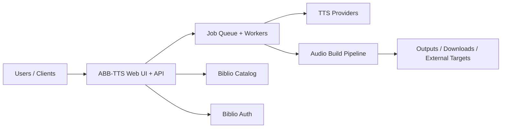

# Biblio Audiobook Builder TTS

> Part of the [BiblioHub](https://github.com/vpoluyaktov/biblio-hub) application suite

## Overview

**Biblio Audiobook Builder TTS** converts eBooks (EPUB/FB2 and related sources) into audiobooks using multiple TTS backends. It provides a web experience for job submission, monitoring, and result delivery.

Core purpose:

- Turn e-book content into audiobook artifacts suitable for playback and library ingestion
- Support multiple provider types (self-hosted and cloud) with configurable conversion behavior
- Enable asynchronous, multi-user conversion workflows with progress visibility
- Integrate with Biblio services (Catalog/Auth) and optional downstream destinations

## Architecture (High Level)



## Interfaces (Summary)

The service provides:

- Web and API workflows for creating and tracking audiobook jobs
- Provider and voice management surfaces
- Real-time progress updates for long-running conversions
- Integration points for catalog sourcing and authentication

Detailed endpoint contracts, configuration references, and operational commands are maintained in `README.md`.

## Project Structure (Key Parts)

```
biblio-audiobook-builder-tts/
├── Specification.md
├── README.md
├── internal/            # server, workers, storage, parser, tts, audio pipelines
├── tests/               # unit/integration coverage
└── output/              # generated artifacts (runtime)
```

## Development Status

**Service status: Operational**

- ✅ End-to-end audiobook generation pipeline is production-capable
- ✅ Multi-provider TTS orchestration and provider-level behavior controls are available
- ✅ Job lifecycle management and user-facing progress workflows are in place
- ✅ Integrated with BiblioHub routing and related platform services

## Development Priorities

1. Conversion reliability and throughput improvements for large workloads
2. UX improvements for provider testing, diagnostics, and operations
3. Security and authentication maturity across deployment modes
4. Continued quality improvements in text preprocessing and narration naturalness

---

### Future Enhancements

- Deeper observability of conversion pipeline stages
- Expanded provider ecosystem and interoperability
- Better automated quality checks for generated audio
- Further improvements for multilingual normalization and narration quality

## Contribution Guidance

- Keep this document high-level (purpose, architecture, state, roadmap).
- Keep endpoint payloads, env matrices, implementation logs, and operational runbooks in `README.md` and dedicated docs.
- Update **Development Status** and **Development Priorities** when capabilities evolve.

---

*Last updated: 2026-02-14*
