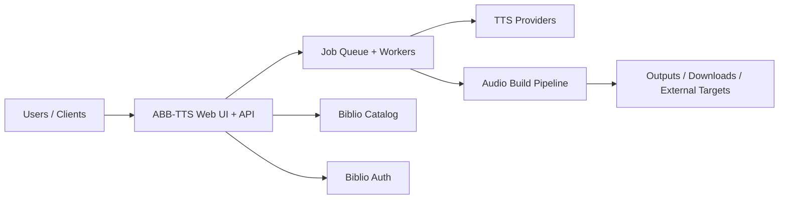

# Biblio Audiobook Builder TTS

> Part of the [BiblioHub](https://github.com/vpoluyaktov/biblio-hub) application suite

## Overview

**Biblio Audiobook Builder TTS** converts eBooks (EPUB/FB2 and related sources) into audiobooks using multiple TTS backends. It provides a web experience for job submission, monitoring, and result delivery.

Core purpose:

- Turn e-book content into audiobook artifacts suitable for playback and library ingestion
- Support multiple provider types (self-hosted and cloud) with configurable conversion behavior
- Enable asynchronous, multi-user conversion workflows with progress visibility
- Integrate with Biblio services (Catalog/Auth) and optional downstream destinations

## Architecture (High Level)



## Interfaces (Summary)

The service provides:

- Web and API workflows for creating and tracking audiobook jobs
- Provider and voice management surfaces
- Real-time progress updates for long-running conversions
- Integration points for catalog sourcing and authentication

Detailed endpoint contracts, configuration references, and operational commands are maintained in `README.md`.

## Project Structure (Key Parts)

```
biblio-audiobook-builder-tts/
├── Specification.md
├── README.md
├── internal/            # server, workers, storage, parser, tts, audio pipelines
├── tests/               # unit/integration coverage
└── output/              # generated artifacts (runtime)
```

## Development Status

**Service status: Operational**

- ✅ End-to-end audiobook generation pipeline is production-capable
- ✅ Multi-provider TTS orchestration and provider-level behavior controls are available
- ✅ Job lifecycle management and user-facing progress workflows are in place
- ✅ Integrated with BiblioHub routing and related platform services

## Development Priorities

1. Conversion reliability and throughput improvements for large workloads
2. UX improvements for provider testing, diagnostics, and operations
3. Security and authentication maturity across deployment modes
4. Continued quality improvements in text preprocessing and narration naturalness

---

## Key Implementation Notes

### Text Processing Pipeline

**Processing Order** (critical for correct results):
1. **Pronunciation Dictionary** (`internal/sanitize/data/*.csv`) - Applied first
   - User-defined regex patterns for word/phrase replacements
   - Supports both plain text and SSML replacements
   - Language-specific rules (en.csv, ru.csv)
   - Pattern order matters - place more specific patterns before general ones

2. **Latin-to-Russian Transliteration** (`internal/sanitize/latin_ru.go`) - Provider toggle
   - Uppercase-only words → letter-by-letter (FBI → эф би ай)
   - Lowercase/mixed-case → phonetic (Microsoft → микрософт)
   - Only applies in Russian text context (20%+ Cyrillic)

3. **Number Normalization** (`internal/normalize/`) - Provider toggle
   - Language-specific processors (russian.go, english.go)
   - Context-aware (dates, ordinals, gender agreement)
   - Noun database for grammatical forms (`data/en.csv`, `data/ru.csv`)

4. **Stress Marking** (`internal/stress/`) - Provider toggle
   - Russian homograph disambiguation
   - Sentence-by-sentence processing

### File Naming Conventions

**Chapter files**: 4-digit prefix format (`%04d`)
- Examples: `0001_Chapter1.txt`, `0001_Chapter1.wav`, `0001_Chapter1.ssml.txt`
- Supports up to 9,999 chapters with correct sorting

**Multi-part M4B files**: 3-digit suffix format (`%03d`)
- Example: `Book_Title, Part 001.m4b`
- Supports up to 999 parts with correct sorting

### Russian Grammar Rules

**Critical patterns to remember**:
- Dates with months → always genitive case (27 марта → двадцать седьмого марта)
- Years before "году" → prepositional case (В 1876 году → одна тысяча восемьсот семьдесят шестом году)
- Measurement units → plural genitive (100 м → 100 метров)
- Gender detection for numbers ending in 2 → check noun database first, then heuristics
- Time formats (HH:MM, HH.MM.SS) → remove punctuation before normalization

### Pronunciation Dictionary Patterns

**Simplified approach - boundary logic in Go code**:
- **CSV patterns are simple** - no `\b` word boundaries or delimiter suffixes needed
  - Pattern: `(\d+)\s*м` (just the core pattern)
  - Replacement: `$1 метров` (simple replacement)
  - **Go code automatically wraps ALL patterns** with `(?:^|\s)` prefix and `(?:[\s.,)]|$)` suffix
  - **Go code always adds a space after replacement**
- Frequency units support decimals: `(\d+\.?\d*)\s*ГГц` matches both "3.5 ГГц" and "1600 МГц"
- Year of birth (г.р.) must come BEFORE weight units (г) in ru.csv
- **Compound units must come BEFORE simple units** (critical for correct matching)
  - `км/ч` (kilometers per hour) must come before `км` (kilometers)
  - `м/с` (meters per second) must come before `м` (meters)
  - `мл` (milliliters) must come before `м` (meters)
  - Pattern order in CSV determines matching priority since Go regexp doesn't support lookahead

**Implementation details**:
- `applyRuleUnicode` in `text.go` wraps every pattern: `(?:^|\s)(PATTERN)(?:[\s.,)]|$)`
- This ensures patterns only match complete words/units at word boundaries
- Matches are processed in reverse order to avoid position shifts
- A space is always added after replacement
- May result in double spaces after commas (e.g., "12 В, 7 А" → "12 вольт  7 ампер")
- Double/triple spaces are acceptable and will be normalized later in the pipeline

---

## Code Quality & Architecture Improvements

### Overall Assessment

**Strengths:**
- ✅ Clean package structure with clear separation of concerns
- ✅ Good test coverage for critical components (sanitize, normalize, TTS providers)
- ✅ Well-documented domain logic (pronunciation rules, grammar patterns)
- ✅ Consistent error handling patterns
- ✅ Good use of interfaces for provider abstraction

**Areas for Improvement:**

### 1. Architecture & Design Patterns

**Error Handling Standardization**
- Consider implementing custom error types for different failure categories
- Add error wrapping with context using `fmt.Errorf("context: %w", err)`
- Implement structured error responses for API endpoints
- Add error recovery strategies for transient failures (retry logic)

**Dependency Injection**
- Some packages have tight coupling to concrete implementations
- Consider using dependency injection containers or wire for larger components
- Make database/storage dependencies more explicit through interfaces

**Configuration Management**
- Centralize configuration validation
- Add configuration schema documentation
- Consider using structured config with validation tags
- Implement hot-reload for non-critical config changes

### 2. Code Organization

**Package Responsibilities**
- `internal/controller/` - Consider splitting into smaller, focused controllers
- `internal/tts/` - Large provider files (400+ lines) could benefit from extraction
  - Separate API client logic from TTS orchestration
  - Extract common provider patterns into shared utilities
- `internal/sanitize/` and `internal/normalize/` - Well-structured, good example

**File Size Management**
- Several files exceed 400 lines (tts/adapter.go, tts/azure_provider.go, etc.)
- Consider extracting helper functions or creating sub-packages
- Break down large functions into smaller, testable units

### 3. Testing Improvements

**Test Coverage Gaps**
- Add integration tests for end-to-end conversion pipeline
- Add performance benchmarks for text processing (sanitize/normalize)
- Add stress tests for concurrent job processing
- Consider property-based testing for text normalization edge cases

**Test Organization**
- Good use of table-driven tests (keep this pattern)
- Consider adding test helpers for common setup/teardown
- Add golden file tests for complex text transformations
- Mock external dependencies (TTS providers, storage) more consistently

### 4. Performance Optimizations

**Text Processing Pipeline**
- ✅ Already optimized: Character replacements use `strings.NewReplacer()`
- ✅ Already optimized: Regex patterns are pre-compiled
- Consider: Parallel processing for large documents (chapter-level parallelism)
- Consider: Caching for repeated text patterns (pronunciation dictionary lookups)

**Memory Management**
- Profile memory usage during large audiobook conversions
- Consider streaming processing for very large files
- Implement buffer pooling for audio processing
- Add memory limits and backpressure for job queue

**Concurrency**
- Review goroutine lifecycle management
- Add context cancellation for long-running operations
- Implement graceful shutdown for in-progress jobs
- Consider worker pool pattern for TTS requests

### 5. Observability & Monitoring

**Logging Improvements**
- Standardize log levels (debug, info, warn, error)
- Add structured logging with consistent field names
- Include correlation IDs for request tracing
- Add performance metrics logging (processing time, queue depth)

**Metrics & Instrumentation**
- Add Prometheus metrics for:
  - Job queue depth and processing time
  - TTS provider latency and error rates
  - Text processing pipeline stages
  - Audio file generation metrics
- Add health check endpoints with dependency status
- Implement distributed tracing (OpenTelemetry)

**Debugging Tools**
- Add debug endpoints for inspecting job state
- Implement dry-run mode for testing text processing
- Add verbose logging mode for troubleshooting
- Create diagnostic tools for provider connectivity

### 6. Security Enhancements

**Input Validation**
- Add comprehensive input sanitization for file uploads
- Validate file sizes and types before processing
- Implement rate limiting for API endpoints
- Add request size limits

**Authentication & Authorization**
- Review Biblio Auth integration security
- Implement API key rotation mechanism
- Add audit logging for sensitive operations
- Consider implementing RBAC for multi-tenant scenarios

**Data Protection**
- Encrypt sensitive configuration (API keys, credentials)
- Implement secure file storage with access controls
- Add data retention policies
- Consider PII handling in uploaded content

### 7. Documentation Improvements

**Code Documentation**
- Add package-level documentation for all packages
- Document complex algorithms (especially in normalize/)
- Add examples for public APIs
- Document thread-safety guarantees

**API Documentation**
- Generate OpenAPI/Swagger specs from code
- Add request/response examples
- Document error codes and recovery strategies
- Create API versioning strategy

**Operational Documentation**
- Add runbooks for common operational tasks
- Document deployment procedures
- Create troubleshooting guides
- Add performance tuning guidelines

### 8. Specific Technical Debt

**Known Issues to Address**
- Double/triple spaces after text processing (acceptable but could be cleaned)
- Potential race conditions in job state management (needs review)
- Provider-specific error handling could be more consistent
- File naming conventions could be more flexible (configurable formats)

**Refactoring Opportunities**
- Extract common TTS provider patterns into base implementation
- Consolidate duplicate sanitization logic
- Simplify complex conditional logic in number normalization
- Consider using generics for common patterns (Go 1.18+)

### 9. Future Architecture Considerations

**Scalability**
- Consider microservices architecture for independent scaling
- Implement distributed job queue (Redis, RabbitMQ)
- Add horizontal scaling support for workers
- Consider serverless functions for text processing

**Extensibility**
- Plugin system for custom TTS providers
- Extensible text processing pipeline (middleware pattern)
- Custom audio post-processing hooks
- Webhook support for job completion notifications

**Cloud-Native Features**
- Kubernetes deployment manifests
- Health checks and readiness probes
- Resource limits and autoscaling
- Service mesh integration

---

### Future Enhancements

- Deeper observability of conversion pipeline stages
- Expanded provider ecosystem and interoperability
- Better automated quality checks for generated audio
- Further improvements for multilingual normalization and narration quality

## Contribution Guidance

- Keep this document high-level (purpose, architecture, state, roadmap).
- Keep endpoint payloads, env matrices, implementation logs, and operational runbooks in `README.md` and dedicated docs.
- Update **Development Status** and **Development Priorities** when capabilities evolve.

---

*Last updated: 2026-02-18*
